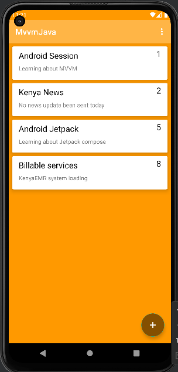
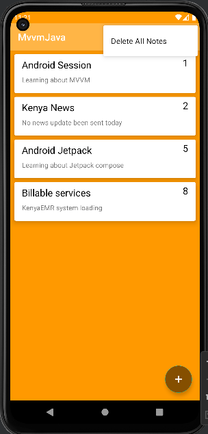
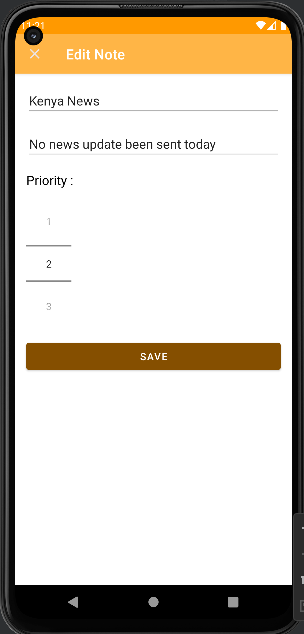

## Notes App
Learning about Java MVVM architecture patterns

### libraries & Language used

1. Java 
2. Live data
3. Room Database
4. XML
5. MVVM Architecture

Screenshot of final app
--------------

---------------------------
Notes                                             |  Add Note
:----------------------------------------------------:|:-------------------------:
  |  
Delete Notes                                            |  Edit Notes 
:----------------------------------------------------:|:-------------------------:
  |  

